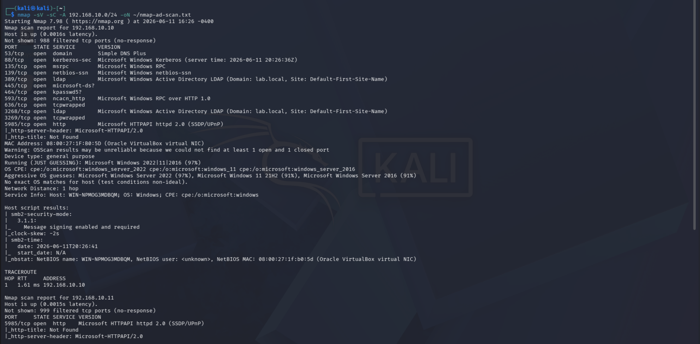
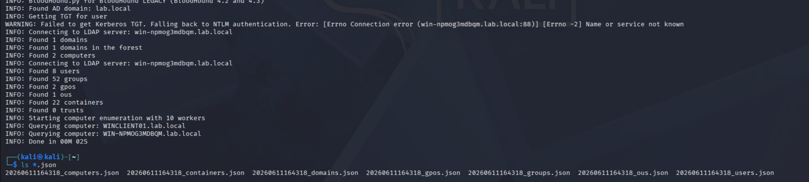
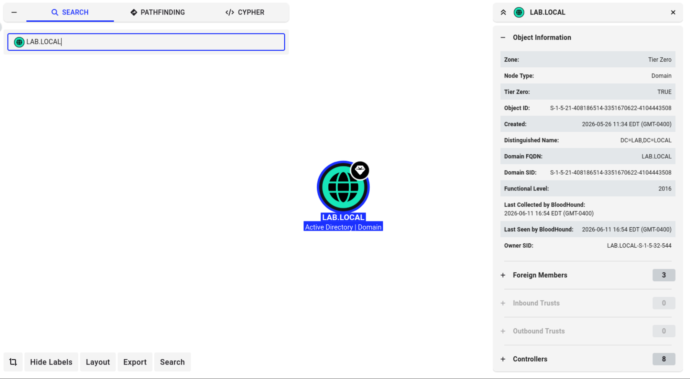
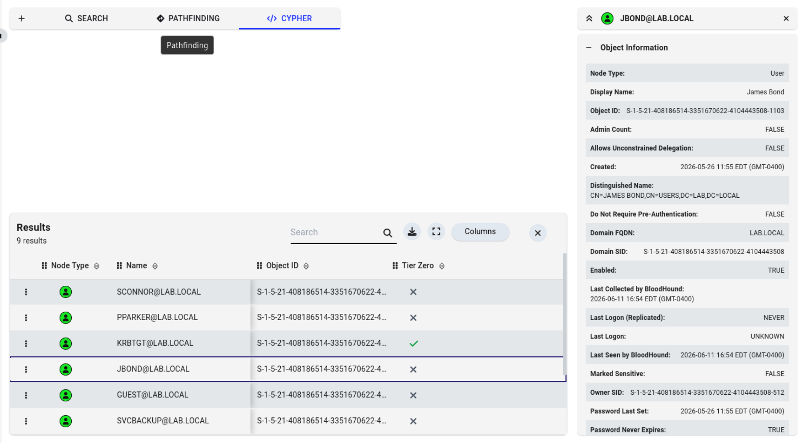

# Phase 4 — Attacks

---

## Attack 1 — Network Reconnaissance (Nmap)

**MITRE ATT&CK:** T1046 — Network Service Discovery

**Goal:** Identify live hosts, open ports, and running services on the internal network before touching anything in AD.

**Tools:** Nmap 7.98

**What I did:**
1. Confirmed Kali (192.168.10.12) was on the internal network
2. Ran a full version/script scan against the entire 192.168.10.0/24 subnet
3. Saved output to `nmap-ad-scan.txt` for documentation

**Command:**
```bash
nmap -sV -sC -A 192.168.10.0/24 -oN ~/nmap-ad-scan.txt
```

**What I found:**

DC (192.168.10.10) had the full AD fingerprint exposed: Kerberos on 88, LDAP on 389, SMB on 445, DNS on 53, and WinRM on 5985. Domain confirmed as `lab.local`, hostname `WIN-NPMOG3MDBQM`. The client (192.168.10.11) was mostly locked down with only WinRM open.


*Terminal showing full Nmap results with open ports on DC and client*

**What I learned:** You can fingerprint an AD environment without any credentials. The port profile alone tells you what you're dealing with.

**Skills it proves:** Network reconnaissance, service enumeration, understanding of AD-specific ports and protocols

---

## Attack 2 — AD Enumeration (BloodHound)
NOTE: I will conduct BloodHound again in further attacks; this was just to play around with it informally. As I accumulate credentials of other users, BloodHound can be formally conducted.

**MITRE ATT&CK:** T1069.002 — Domain Groups, T1087.002 — Domain Account Discovery

**Goal:** Map every user, group, computer, and permission relationship in the domain to find attack paths to Domain Admin.

**Tools:** bloodhound-python, BloodHound CE

**What I did:**
1. Added a NAT adapter to Kali for internet access while keeping the internal network adapter
2. Installed `bloodhound-python` via pip
3. Ran the collector against the DC using admin credentials
4. Imported JSON output into BloodHound CE and explored the domain

**Command:**
```bash
bloodhound-python -u administrator -p <password> -d lab.local -ns 192.168.10.10 -c all
```

**Note on credentials:** This simulates an attacker who already compromised one account, which is realistic. In a real engagement, initial creds come from password spraying or phishing first. We ran BloodHound here to learn the tool before running those attacks.

**What I found:**

BloodHound pulled the full domain structure for `lab.local` including all users, groups, and the domain controller. The domain was created 2026-05-26, running at functional level 2016. Cypher queries confirmed all AD accounts were enumerated successfully.

### Screenshots

*Terminal showing the collected `.json` files after running bloodhound-python*


*BloodHound GUI showing LAB.LOCAL domain node with object info panel*


*Cypher query results showing all enumerated domain users*

**What I learned:** BloodHound gives an attacker a complete picture of the domain in minutes. Defenders have no built-in way to detect or block this since it uses legitimate LDAP queries.

**Skills it proves:** AD enumeration, BloodHound/Neo4j, understanding of domain trust relationships and attack path analysis

---
