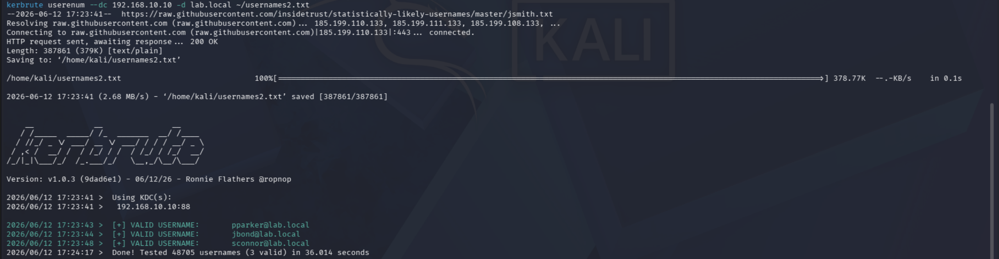

# Phase 4 — Attacks
---
## Attack 2 — User Enumeration (Kerbrute)
**MITRE ATT&CK:** T1087.002 — Account Discovery: Domain Account
**Goal:** Enumerate valid domain accounts without triggering lockouts or needing credentials.
**Tools:** Kerbrute
**What I did:**
1. Ran Kerbrute from Kali against the DC using a standard username wordlist
2. Let it test each username against the Kerberos pre-authentication endpoint
3. Recorded confirmed valid accounts for use in later attacks

**Command:**
```bash
kerbrute userenum --dc 192.168.10.10 -d lab.local ~/usernames2.txt
```

**What I found:**
Three valid accounts came back: `pparker`, `jbond`, `sconnor`. The `svcbackup` service account did not appear since it is not in standard wordlists. Kerbrute works by sending Kerberos AS-REQ packets and reading the error codes the DC returns. A valid username gets a different error than an invalid one, which lets you enumerate accounts without ever attempting a full login.

### Screenshots

*Kerbrute confirming pparker, jbond, and sconnor as valid domain accounts*

---

**What I learned:** Kerberos error codes leak whether a username exists. No credentials needed and no lockouts triggered since no passwords are being attempted.

**Skills it proves:** Active Directory reconnaissance, Kerberos protocol fundamentals, credential-free enumeration techniques

---
