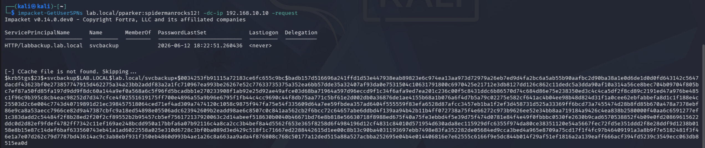
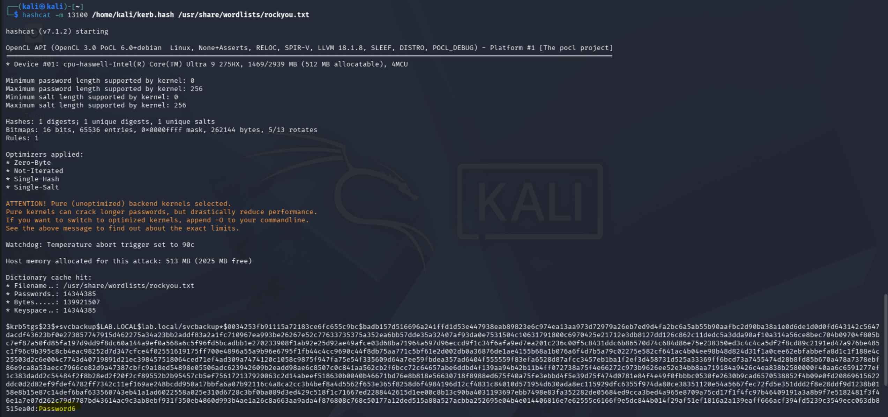

# Phase 4 — Attacks
---
## Attack 4 — Kerberoasting
**MITRE ATT&CK:** T1558.003 — Steal or Forge Kerberos Tickets: Kerberoasting

**Goal:** Request a Kerberos service ticket for a service account with an SPN and crack the hash offline to recover the account password.

**Tools:** Impacket (GetUserSPNs), Hashcat

**What I did:**
1. Used `pparker`'s cracked credentials from the AS-REP Roasting attack to authenticate
2. Ran GetUserSPNs to find accounts with SPNs registered and request their TGS tickets
3. Saved the hash and cracked it with Hashcat

**Commands:**
```bash
impacket-GetUserSPNs lab.local/pparker:spidermanrocks12! -dc-ip 192.168.10.10 -request
```

```bash
echo '$krb5tgs$23$...' > /home/kali/kerb.hash
hashcat -m 13100 /home/kali/kerb.hash /usr/share/wordlists/rockyou.txt
```

**What I found:**
GetUserSPNs returned a TGS hash for `svcbackup`, the service account with an SPN registered during lab setup. Any authenticated domain user can request a service ticket for any SPN. The ticket is encrypted with the service account's password hash and can be taken offline with no lockout risk.

One issue hit before the hash came back: Kerberos rejected the request with a clock skew error. Kerberos requires client and DC clocks to be within 5 minutes of each other. Kali was on UTC and the DC had no timezone configured, pushing the delta past the limit. Fixed by setting the DC to Eastern Time. The request went through after that.

The hash cracked successfully this time without having to use any rule-based approach because the password lacked fortification. 

### Screenshots

*GetUserSPNs returning the TGS hash for svcbackup*


*svcbackup password recovered via hashcat*

---

**What I learned:** Kerberoasting is a silent killer. The ticket request looks identical to normal Kerberos traffic and nothing gets flagged unless the SIEM is specifically watching for RC4 encryption on service ticket requests. The clock skew error was a good reminder that Kerberos is time-sensitive and syncing clocks is part of the pre-attack checklist IRL.

**Skills it proves:** Kerberos service ticket abuse, SPN enumeration, lateral movement prerequisites, offline hash cracking

---
