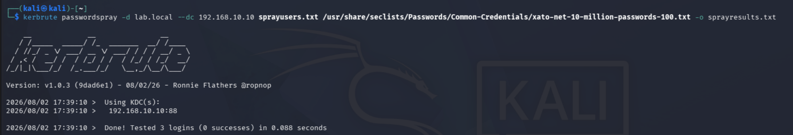
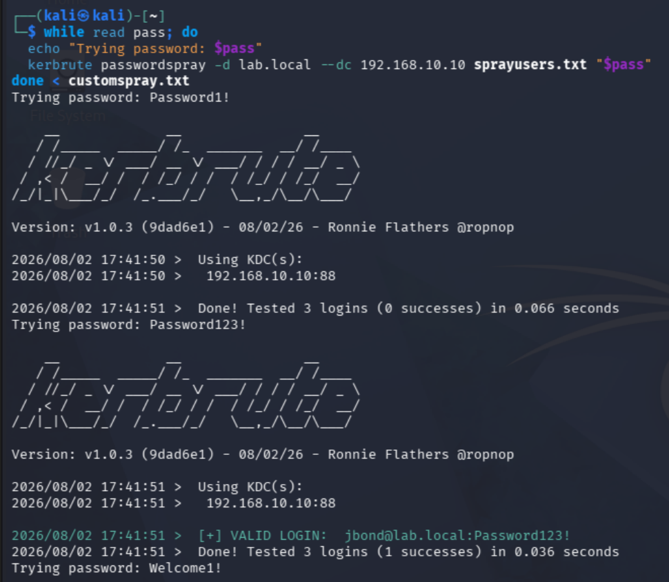
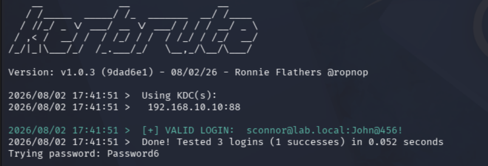

## Attack 5 : Password Spraying
**MITRE ATT&CK:** T1110.003 — Brute Force: Password Spraying
**Goal:** Attempt a small number of common or likely passwords across all known domain accounts to identify weak credentials without triggering account lockout.
**Tools:** Kerbrute

**What I did:**
1. Rebuilt the confirmed username list from the earlier Kerbrute enumeration (pparker, jbond, sconnor)
2. Ran a first spray using a generic top-100 common password list to test the naive approach
3. Got zero hits, which made sense once I thought about it, real accounts rarely use literal top-100 passwords like "123456" or "password"
4. Built a second, targeted password list based on common corporate password policy patterns (capitalized word + numbers + symbol) combined with seasonal/date guesses
5. Looped Kerbrute manually across each password in the list against all users, since Kerbrute's passwordspray command only accepts a single password per run, not a wordlist file
6. Got valid logins for jbond and sconnor on the second, targeted attempt

**Commands:**
```bash
cat << 'EOF' > sprayusers.txt
pparker
jbond
sconnor
EOF
```
```bash
kerbrute passwordspray -d lab.local --dc 192.168.10.10 sprayusers.txt /usr/share/seclists/Passwords/Common-Credentials/xato-net-10-million-passwords-100.txt -o sprayresults.txt
```
```bash
cat << 'EOF' > customspray.txt
Password1!
Password123!
Welcome1!
Welcome123!
Charlotte1!
Summer2026!
Company123!
Spring2026!
John@456!
Password6
EOF
```
```bash
while read pass; do
  echo "Trying password: $pass"
  kerbrute passwordspray -d lab.local --dc 192.168.10.10 sprayusers.txt "$pass"
done < customspray.txt
```

**What I found:**
The generic top-100 list returned zero hits. That result matters as much as the success does. Most real accounts today aren't using literal top passwords like "123456", so a naive spray against a generic list usually fails in practice too. Real attackers build targeted lists based on known password policies, seasonal patterns, and OSINT on the target organization instead of guessing blind.

Switching to a targeted list built around a realistic corporate password policy (capital letter, numbers, symbol) got hits. `jbond` and `sconnor` were both using weak, predictable passwords that fit common patterns. This shows why password spraying works in the real world, it's not about having a magic wordlist, it's about understanding how people actually create passwords under a policy and guessing intelligently.

One technical snag: Kerbrute's `passwordspray` command takes a single password as an argument, not a wordlist file. Passing a file path directly just tests the literal string as a password and returns instantly with 0 successes. Fixed by looping through the password list manually in bash, running Kerbrute once per password against the full user list, which is also how password spraying is actually meant to work operationally: one password across every account, then move to the next password.

### Screenshots

*Zero hits from a generic top-100 password list*

*Valid logins recovered for jbond and sconnor using a targeted, policy-informed password list*

*sconnor password*

---
**What I learned:** Password spraying is only as good as the list behind it. A blind generic list will usually fail against anything but the weakest accounts, but a list built around real password policy patterns and organizational context succeeds far more often. The Kerbrute command quirk was also a good reminder to actually read what a tool's flags expect instead of assuming file input works everywhere.
**Skills it proves:** Password spraying methodology, lockout-aware authentication testing, password policy pattern analysis, tool troubleshooting under unexpected behavior
---
