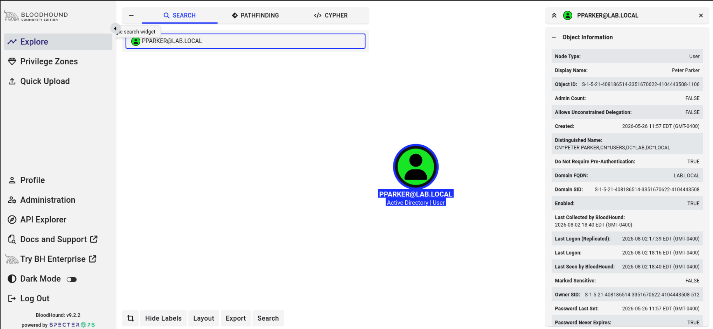
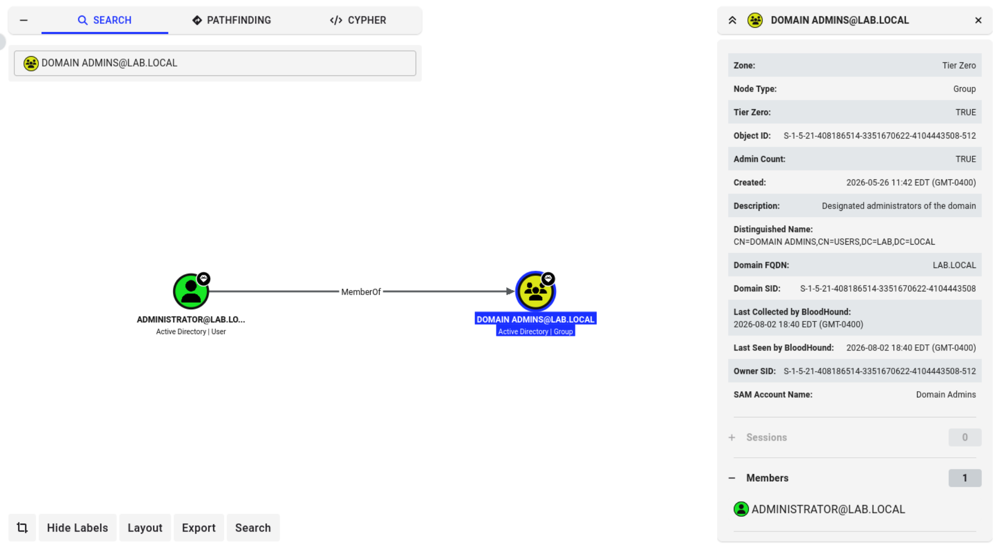
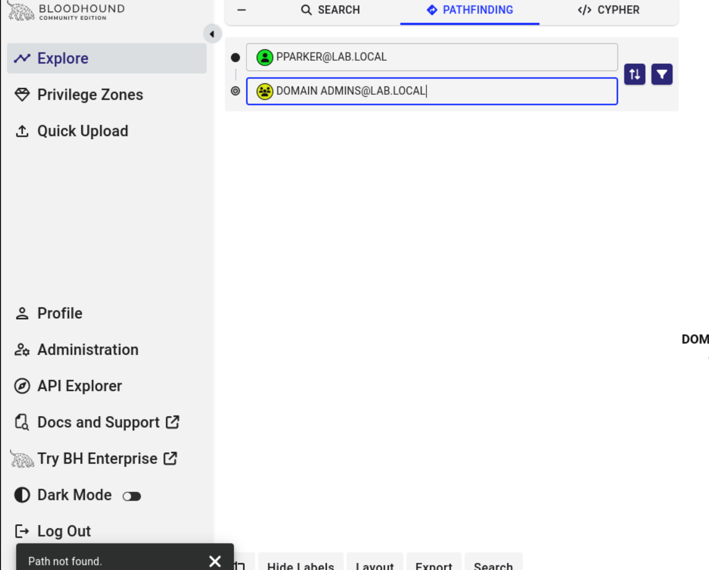
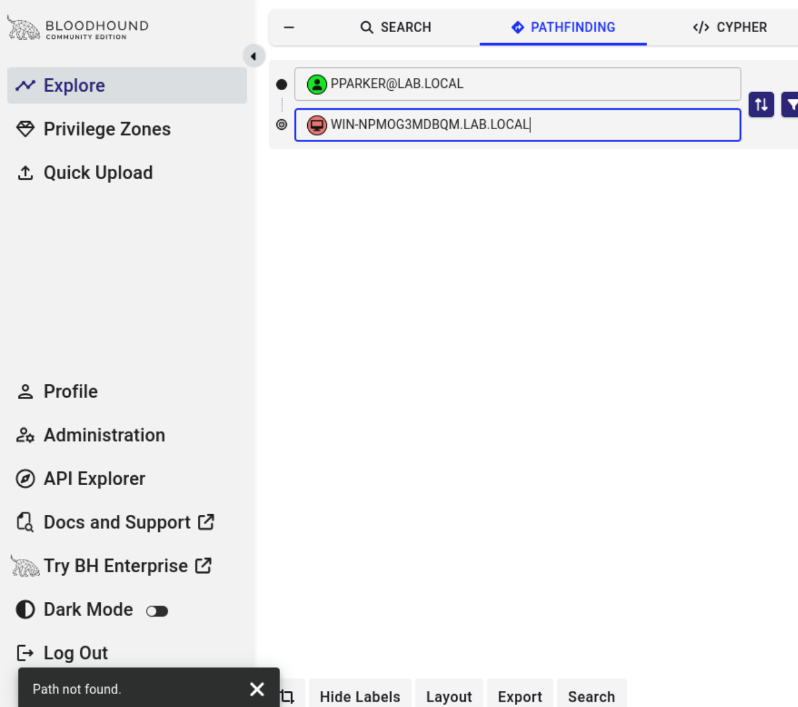

# Phase 4 : Attacks
---

## Attack 6 : BloodHound
**MITRE ATT&CK:** T1087.002 — Account Discovery: Domain Account, T1069.002 — Permission Groups Discovery: Domain Groups
**Goal:** Map Active Directory relationships and identify potential privilege escalation paths from compromised accounts to Domain Admin.
**Tools:** BloodHound CE (Community Edition), bloodhound-python collector, Neo4j

**What I did:**
1. Ran bloodhound-python against the DC using pparker's cracked credentials to collect domain data (users, groups, computers, GPOs, ACLs, sessions)
2. Uploaded the collection to BloodHound CE and confirmed successful ingestion by searching for the pparker node directly
3. Used Pathfinding to check for any escalation path from each compromised account (pparker, jbond, sconnor) to Domain Admins
4. Also checked for a path from pparker to the DC computer object directly, to rule out local admin access as an alternate route

**Commands:**
```bash
bloodhound-python -u pparker -p 'spidermanrocks12!' -d lab.local -dc WIN-NPMOG3MDBQM.lab.local -c All -ns 192.168.10.10 --zip
```

**What I found:**
Pathfinding returned "Path not found" for all three compromised accounts against Domain Admins, and also against the DC computer object directly. Checking the Domain Admins group itself confirmed only the built-in Administrator account is a member, no other user or group has been granted that membership.

This is a legitimate and useful finding on its own. Not every AD environment has an open privilege escalation path, and confirming that absence is just as important a skill as finding one. It means further access in this lab would require a different technique entirely, most likely Pass-the-Hash against local admin credentials or session data rather than a domain-wide ACL or group membership abuse path.

One setup issue I had: BloodHound CE's backend service (bhapi) failed to start after I reset the neo4j database password, since bhapi stores its own expected neo4j credential in `/etc/bhapi/bhapi.json` separately from the actual neo4j account. Had to trace the failure through systemd logs, find the config file, and reset neo4j's password to match what bhapi expected instead of the other way around.

### Screenshots

*Successful data ingestion confirmed via pparker user node lookup, showing DoNotRequirePreAuth flag matching the AS-REP Roasting finding*

*Domain Admins group membership showing only the built-in Administrator account*

*Pathfinding confirming no escalation path exists from pparker to Domain Admins*

*Pathfinding confirming no path exists from pparker to the DC computer object directly*

---
**What I learned:** BloodHound's real value isn't about just finding a path, it's definitively ruling paths out too. A clean "no path found" across every compromised account is a real security posture confirmation, not a dead end. I also learned that BloodHound CE's backend and Neo4j maintain separate credential expectations, which is an easy thing to break if you reset one without checking the other.

**Skills it proves:** AD relationship mapping, attack path analysis, privilege escalation assessment, troubleshooting multi-service application stacks

---

