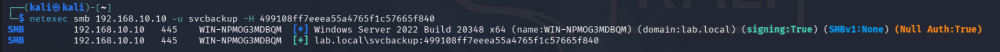
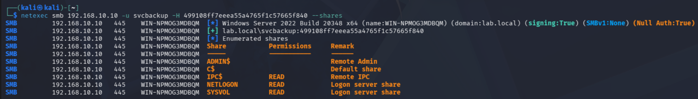

# Phase 4 : Attacks
---

## Attack 7 : Pass-the-Hash
**MITRE ATT&CK:** T1550.002 — Use Alternate Authentication Material: Pass the Hash
**Goal:** Authenticate to a domain machine using an account's NTLM hash instead of its plaintext password, then enumerate the access that credential provides.
**Tools:** NetExec, Impacket (secretsdump), Python (hashlib)

**What I did:**
1. Attempted to dump hashes from the DC using pparker, which failed with access denied, confirming pparker is a low-privilege user with no replication or local admin rights
2. Calculated svcbackup's NTLM hash from the known password using Python, since Pass-the-Hash authenticates with the hash directly rather than the plaintext
3. Passed the hash to the DC using NetExec's -H flag to prove hash-based authentication works without ever sending the plaintext password
4. Enumerated the SMB shares svcbackup could access to determine the real-world impact of the compromised credential

**Commands:**
```bash
impacket-secretsdump lab.local/pparker:'spidermanrocks12!'@192.168.10.10
```
```bash
python3 -c "import hashlib; print(hashlib.new('md4', 'Password6'.encode('utf-16le')).hexdigest())"
```
```bash
netexec smb 192.168.10.10 -u svcbackup -H 499108ff7eeea55a4765f1c57665f840
```
```bash
netexec smb 192.168.10.10 -u svcbackup -H 499108ff7eeea55a4765f1c57665f840 --shares
```

**What I found:**
The secretsdump attempt with pparker failed with rpc_s_access_denied, which confirmed pparker holds no local admin or replication rights on the DC. That is expected for a standard domain user and is a useful negative result on its own.

Pass-the-Hash with svcbackup's NTLM hash succeeded against the DC. NetExec returned a [+] on the authentication, proving the hash alone is enough to authenticate, the plaintext password is never needed once the hash is known. This is the core danger of the technique: an attacker who dumps or derives a hash can authenticate as that user without ever cracking it.

Share enumeration showed the practical limit of this access. svcbackup could read IPC$, NETLOGON, and SYSVOL, which are standard shares any authenticated domain user can read. It could see ADMIN$ and C$ existed but had no access to them, confirming svcbackup is not a local admin on the DC. So the hash authenticates successfully but only grants baseline domain user access, not elevated control.

One important lesson surfaced mid-attack: the password cracked earlier during Kerberoasting no longer worked when tested live. A Kerberos service ticket is encrypted with the account's password hash at the moment the ticket is issued, so if the password changes afterward, the cracked value reflects the old state, not the current one. This is exactly why offline cracking results should always be validated against the live environment before being relied on. For the lab I reset the account back to the known password to continue demonstrating the technique cleanly.

### Screenshots

*NetExec authenticating to the DC using only svcbackup's NTLM hash, no plaintext password*

*Share enumeration showing svcbackup has only baseline domain user read access, no admin shares*

---

**What I learned:** Pass-the-Hash decouples authentication from knowing a password, which is what makes stolen hashes so dangerous. But a successful authentication does not automatically mean elevated access, the account's actual rights still cap what you can do. I also learned firsthand why cracked credentials must be validated live, since Kerberos ticket passwords can go stale the moment an account password changes.

**Skills it proves:** NTLM hash-based authentication, credential impact assessment, SMB share enumeration, understanding Kerberos ticket encryption and its limitations

---

