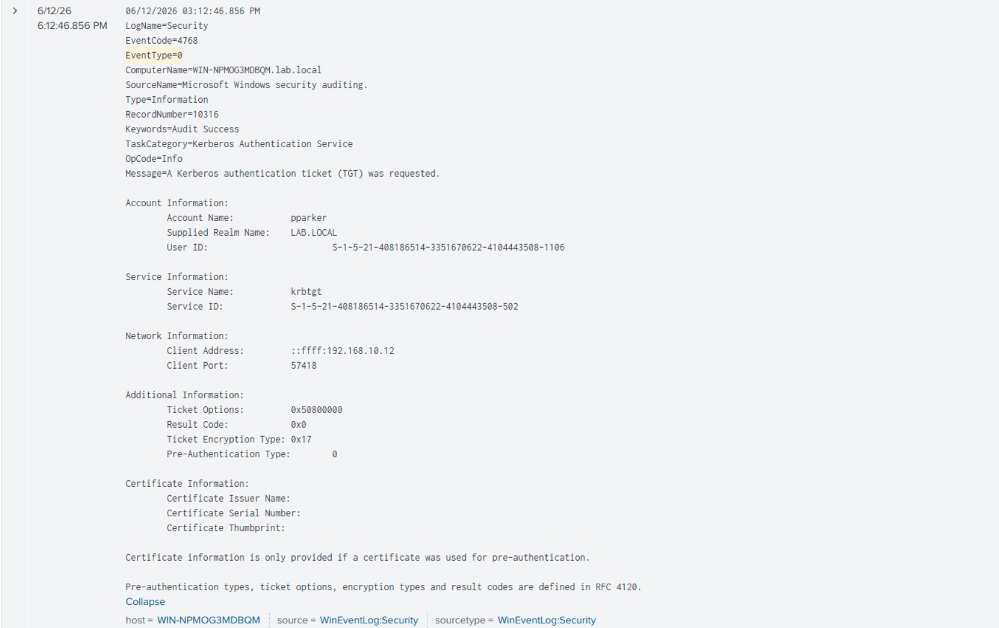
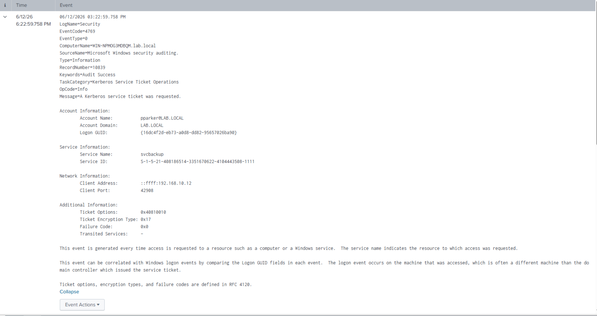

# Splunk Detections
---

All detections run against the `wineventlog` index. Each query is paired with the attack it covers and an explanation of why the EventCode matters.

---

## Detection 1 — Kerbrute (User Enumeration)

**EventCode:** 4771 — Kerberos pre-authentication failed

Note: Kerbrute enumeration does not appear in standard Windows Event Logs. No 4771 events were generated during testing. Detection requires network-level monitoring or verbose Kerberos auditing, which is outside the scope of this lab.

---

## Detection 2 — AS-REP Roasting

**EventCode:** 4768 — Kerberos Ticket Granting Ticket (TGT) requested

Normal logins always include preauthentication. When an account has it disabled, the DC issues a TGT without verifying identity first. The pre-authentication type field in the 4768 event is set to 0 in this case. That value never appears in legitimate logins.

```spl
index=wineventlog EventCode=4768 Pre_Authentication_Type=0
```

**What to look for:** Any 4768 with Pre_Authentication_Type=0. One event is already suspicious. There is no legitimate reason for this in a well-configured domain.

### Screenshots

*EventCode 4768 with Pre_Authentication_Type=0 confirming AS-REP Roasting logged*

---

## Detection 3 — Kerberoasting

**EventCode:** 4769 — Kerberos service ticket requested

Service ticket requests are normal. What is not normal is requesting them with RC4 encryption (Ticket_Encryption_Type=0x17) in an environment that supports AES. Impacket requests RC4 by default because it produces a weaker hash that is faster to crack. Modern environments using AES-only policies will never generate 0x17 in legitimate traffic.

```spl
index=wineventlog EventCode=4769 Ticket_Encryption_Type=0x17
```

**What to look for:** RC4 service ticket requests from a non-service account, especially in bulk. One might be a legacy application. Several in a short window from the same IP is Kerberoasting.

### Screenshots

*EventCode 4769 with RC4 encryption type from Kali IP during Kerberoasting*

---
