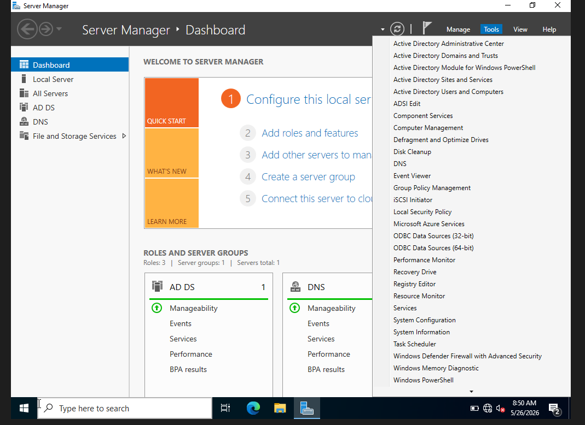
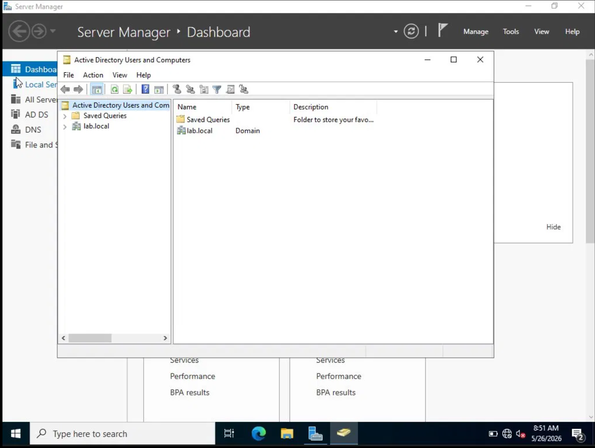
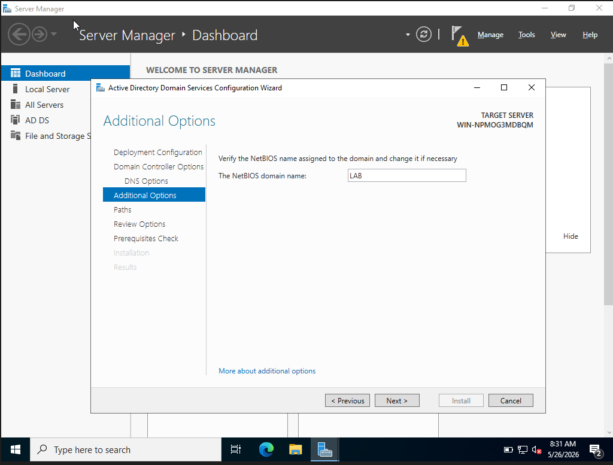
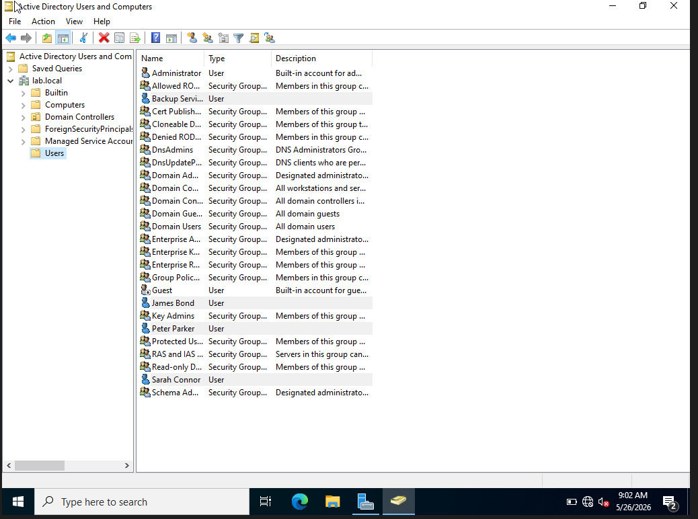
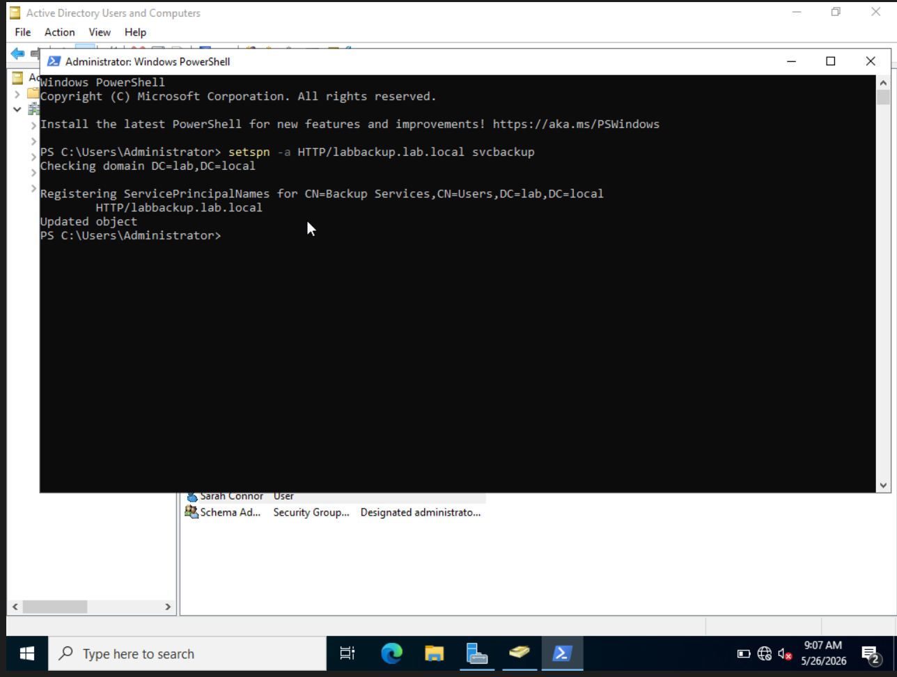
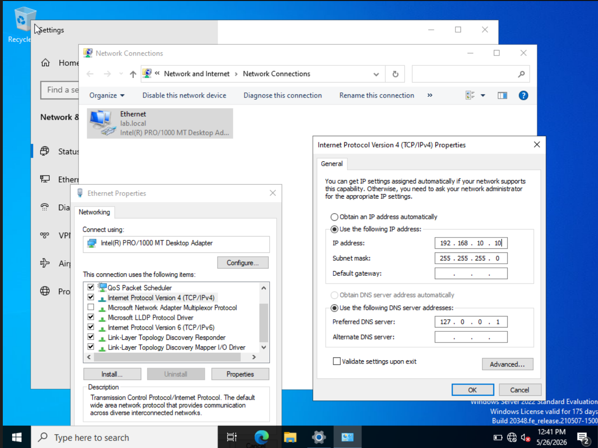
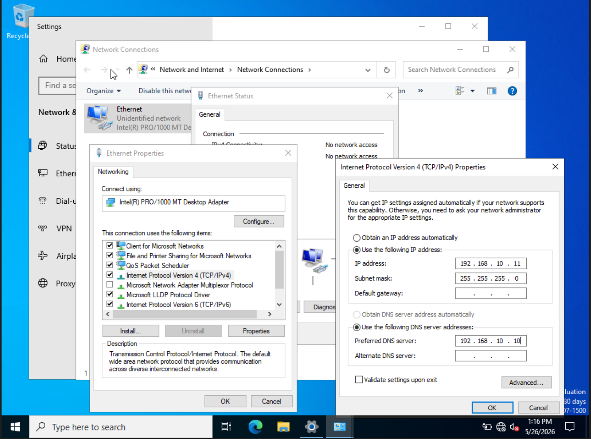
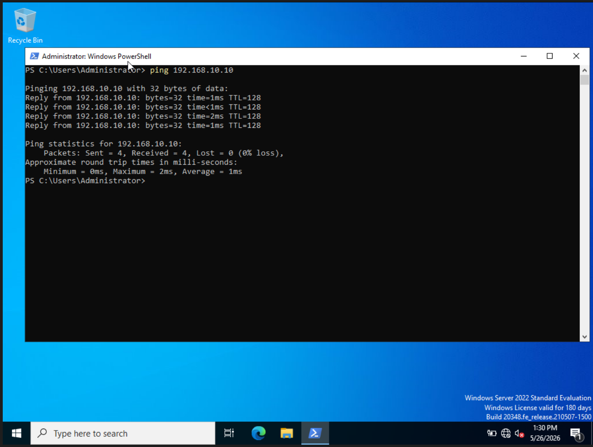
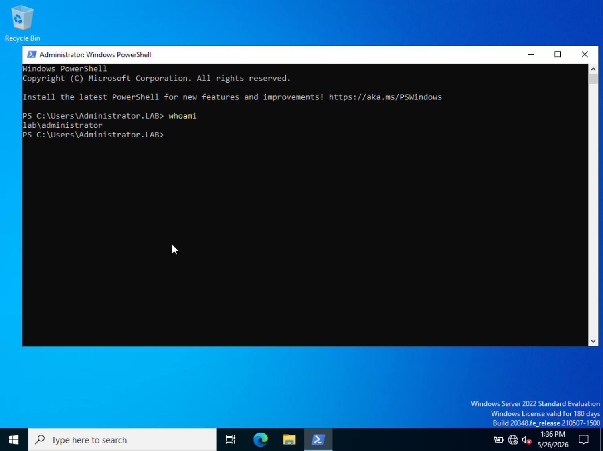

# 02 - Active Directory Setup & Client Configuration

## Overview
This phase turns the bare Windows Server 2022 VM into a working Active Directory 
environment. By the end of this, I had a domain controller running lab.local, a handful 
of intentionally weak user accounts, and a second VM joined to the domain. Everything 
future attacks and detections will run against lives here.

---

## Part 1 — Installing Active Directory Domain Services

### What is AD DS?
Active Directory Domain Services is the Windows role that lets a server manage users, 
computers, and authentication across an entire network. Without it, the server is just 
a regular Windows machine. Installing AD DS is what gives it the ability to become a 
Domain Controller.

### Steps
1. Opened Server Manager and clicked Add Roles and Features
2. Selected Role-based installation
3. Checked Active Directory Domain Services
4. Clicked through and installed
5. After install, clicked the yellow flag and hit "Promote this server to a domain controller"

### Configuration Choices
- New forest — building from scratch, no existing AD to join
- Root domain: `lab.local` — internal only, doesn't exist on the public internet
- NetBIOS name: `LAB` — the short name you see in `LAB\username` format
- DSRM password — emergency recovery password in case AD breaks

### Why These Choices Matter
Every company runs one forest. `lab.local` uses `.local` to keep it internal. The NetBIOS 
name LAB is what prefixes every account: `LAB\jbond`, `LAB\Administrator`, and so on. 
Nothing fancy here, just the standard setup you'd find in a real corporate environment.

### Screenshots

*Server Manager with AD DS and DNS roles active, Tools menu showing Active Directory Users and Computers*


*Active Directory Users and Computers showing lab.local domain created successfully*


*NetBIOS domain name set to LAB*

---

## Part 2 — Creating AD Users

### Why We Create Users
Real networks have hundreds of accounts with different permission levels. Attackers 
enumerate these looking for weak passwords and misconfigurations. The accounts below 
are intentionally vulnerable so I have real targets to practice against.

### Users Created
| Username | Full Name | Password | Notes |
|---|---|---|---|
| jbond | James Bond | Password123! | Weak password, password spray target |
| pparker | Peter Parker | spidermanrocks12! | Weak password |
| sconnor | Sarah Connor | John@456! | Weak password |
| svcbackup | Backup Services | Backingup123! | Service account, Kerberoasting target |

All accounts set to Password never expires to simulate a common enterprise misconfiguration.

### Registering an SPN on svcbackup
A Service Principal Name tells Kerberos that an account runs a specific service. Any 
domain user can request a Kerberos ticket for that account. The ticket comes back 
encrypted with the account's password hash, which means an attacker can take it offline 
and crack it without ever touching the account directly. No lockout, no alerts. That is 
Kerberoasting.

```powershell
setspn -a HTTP/labbackup.lab.local svcbackup
```

### Screenshots

*All users in Active Directory Users and Computers — jbond, pparker, sconnor, svcbackup all visible*


*SPN registered on svcbackup — "Updated object" confirms it worked*

---

## Part 3 — Network Configuration

### Why Internal Network?
Both VMs started on NAT, meaning they each had their own separate internet connection 
and had no idea the other existed. Switching both to VirtualBox Internal Network 
(labnetwork) creates a private virtual switch between them that is completely cut off 
from the internet, which is exactly how an isolated corporate network segment works.

### Static IP Assignment
| Machine | IP Address | Subnet Mask | DNS |
|---|---|---|---|
| Domain Controller | 192.168.10.10 | 255.255.255.0 | 127.0.0.1 (itself) |
| Windows Client | 192.168.10.11 | 255.255.255.0 | 192.168.10.10 (DC) |
| Kali (next phase) | 192.168.10.12 | 255.255.255.0 | 192.168.10.10 (DC) |

The DC points DNS at 127.0.0.1 because it runs its own DNS server and talks to itself. 
The client points DNS at 192.168.10.10 because it has no DNS server of its own. When 
it needs to find lab.local to join the domain, it asks the DC. Without this, the client 
would look for lab.local on the public internet, find nothing, and fail the domain join.

### Screenshots

*Domain Controller set to static IP 192.168.10.10*


*Client set to 192.168.10.11 with DNS pointing at the DC*

---

## Part 4 — Windows Client Setup

### Why a Separate Client VM?
Employees at real companies never log directly into the Domain Controller. They use 
workstations that are joined to the domain. Attacks like Pass-the-Hash start by 
compromising a workstation and then using stolen credentials to move laterally to the DC. 
Without a client VM, there is no attack chain to simulate.

### What Went Wrong — Cloning the DC
First attempt was cloning the Windows Server 2022 VM to save time. That failed 
immediately. Cloning a Domain Controller creates a duplicate machine with the same AD 
identity, and when the clone tried to log in, AD rejected it with a trust relationship 
error. It saw two machines claiming to be the same DC, which AD does not allow.

The fix was to delete the clone and do a fresh Windows Server 2022 install on a new VM, 
this time stopping after the OS install without touching Server Manager or promoting it 
to a DC. Just a plain Windows machine that could join the domain as a regular workstation.

### Joining the Domain
```powershell
Add-Computer -DomainName "lab.local" -Credential LAB\Administrator -Restart
```

This contacts the DC through DNS, authenticates with the Domain Administrator credentials, 
registers the client as a computer object in AD, and reboots to apply the change.

### Verifying the Domain Join
```powershell
whoami
```

### Screenshots

*Client pinging DC at 192.168.10.10 with 0% packet loss — network connectivity confirmed*


*whoami returns lab\administrator — client is authenticating against the domain, not a local account*

---

## Part 5 — Problems & Fixes

| Problem | Root Cause | Fix |
|---|---|---|
| Cloned VM trust relationship error | Cloning a DC creates a duplicate AD identity | Fresh OS install, no domain promotion |
| DC showed 169.254.x.x after reboot | Static IP didn't persist | Re-entered static IP manually |
| Client couldn't ping DC | DC had lost its static IP | Fixed DC IP, ping worked immediately |
| Client ping bounced back from 192.168.10.11 | DC was offline | Booted DC first, retried ping |

---

## What I Learned
You cannot clone a Domain Controller. AD sees it as a duplicate and rejects it outright.

DNS is the entire foundation of Active Directory. The domain join fails completely 
without the client pointing its DNS at the DC first.

Static IPs are non-negotiable on a DC. If the IP changes, nothing on the network can 
find it.

The 169.254.x.x range (APIPA) means Windows gave up waiting for a proper IP and 
assigned itself one automatically. Seeing that address is always a sign something is 
wrong with the network config.

whoami returning lab\administrator is end-to-end proof that domain authentication works.

And the most important thing I learned: how to resize a VirtualBox window so I am not 
squinting at a tiny screen for the rest of this project.

---

## Current Lab State
- Domain Controller running lab.local at 192.168.10.10
- AD users created with weak passwords: jbond, pparker, sconnor, svcbackup
- svcbackup has an SPN registered and is ready for Kerberoasting
- Windows Client joined to the domain at 192.168.10.11
- Both VMs on isolated labnetwork internal network
- Snapshot taken: "Lab Complete - Pre-Attack"

## Next Step
Install Splunk on the Domain Controller and configure Windows Event Log forwarding 
from the client so all attack activity gets captured in the SIEM.
