# 03 - Splunk Setup & Log Forwarding

## Overview
Up until this point the lab had a working AD environment but no visibility into 
what was happening on any of the machines. This phase fixes that. By the end of 
it, Windows Event Logs from both the DC and the client were streaming into Splunk 
in real time, and Kali was configured on the internal network ready to attack. 
When attacks run next session, every single event they generate will be captured 
and searchable.

---

## Part 1 — Installing Splunk on the Domain Controller

### What is Splunk and why the DC?
Splunk is a SIEM: Security Information and Event Management. It collects logs 
from machines across a network, stores them in a searchable database, and lets 
you write queries to find suspicious activity.

It's installed on the DC specifically because the DC is the single point of truth 
for everything that happens in the domain. Every Kerberos ticket request, every 
domain login, every password change, every privilege assignment gets logged here 
regardless of which machine triggered it. When jbond logs in from the client, 
that authentication event gets recorded on the DC, not the client. If an attacker 
Kerberoasts svcbackup from Kali, that shows up on the DC. The DC sees everything, 
which makes it the right place to collect from.

### Installation Steps
1. Temporarily switched DC network adapter from Internal Network to NAT for internet access
2. Set IPv4 back to automatic to get a DHCP address
3. Downloaded Splunk Enterprise Windows .msi from splunk.com
4. Ran installer with default settings and set admin credentials
5. Switched network back to Internal Network and reset static IP to 192.168.10.10
6. Accessed Splunk web interface at http://localhost:8000

### Configuring the Receiving Port
Settings → Forwarding and Receiving → Configure Receiving → New Receiving Port → 9997

Port 9997 is Splunk's standard port for receiving forwarded logs. Opening it tells 
Splunk to listen on that port for incoming data from forwarders on other machines.

### Creating the wineventlog Index
Settings → Indexes → New Index → named it wineventlog

An index in Splunk is basically a dedicated folder for a specific type of data. 
Keeping Windows Event Logs in their own index makes searches faster and keeps 
things organized when more data sources get added later.

### Configuring DC Logs via inputs.conf
Since Splunk is installed directly on the DC, there's no forwarder needed. 
Instead I edited inputs.conf directly to tell Splunk which Windows Event Log 
channels to collect from the DC itself.

Navigated to:
C:\Program Files\Splunk\etc\system\local\

Created inputs.conf with:
[WinEventLog://Security]
index = wineventlog
disabled = false
[WinEventLog://System]
index = wineventlog
disabled = false
[WinEventLog://Application]
index = wineventlog
disabled = false

Then restarted Splunk:
```powershell
cd "C:\Program Files\Splunk\bin"
.\splunk restart
```

### Why These Three Channels?
Security is the most important one for this lab. Every login, failed login, 
Kerberos ticket request, and privilege assignment gets recorded. This is 
where attack activity shows up. EventCodes like 4769 (Kerberoasting), 4625 
(failed login), and 4672 (privilege escalation) all show up in the Security log.

System captures OS-level events like services starting and stopping. Malware 
often installs itself as a Windows service, so unusual service activity is 
worth monitoring.

Application captures software-level events like crashes and errors. This is less 
critical for attack detection but just good to have.

### Screenshots
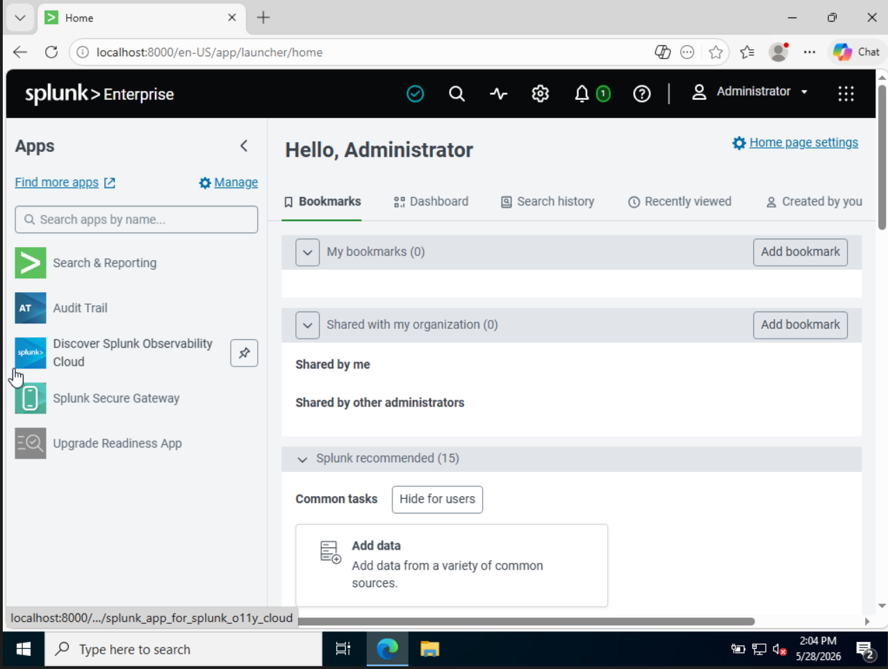
*Splunk Enterprise running at localhost:8000*

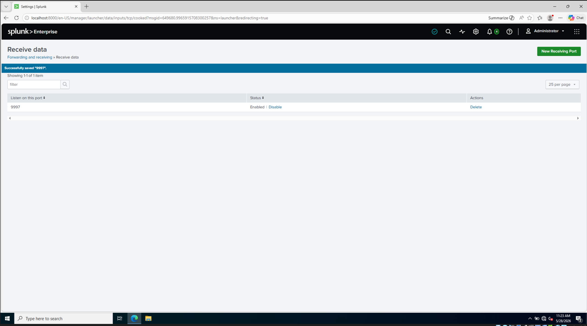
*Port 9997 configured*

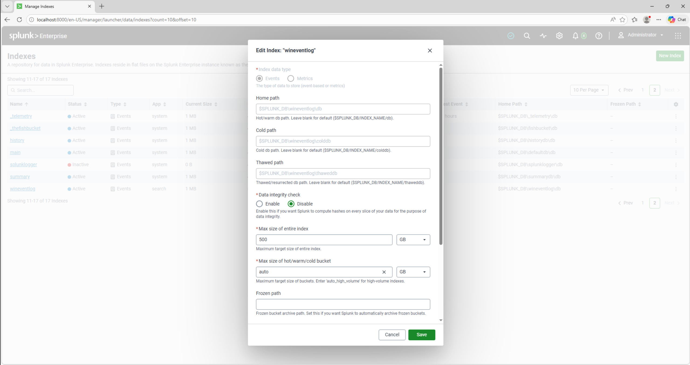
*wineventlog index created*


*wineventlog active*

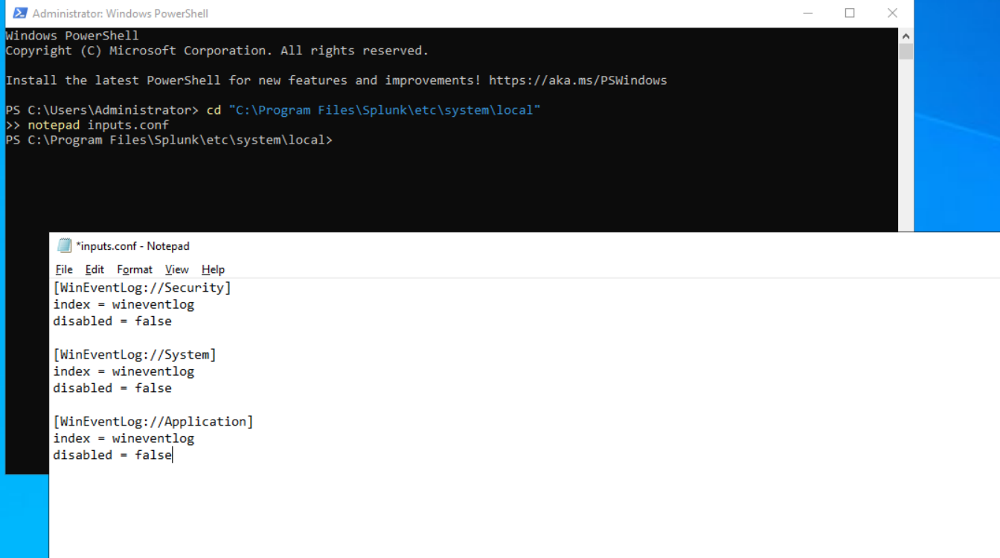
*inputs.conf configured on the DC with all three log channels*

---

## Part 2 — Installing Splunk Universal Forwarder on the Client

### What is the Universal Forwarder?
The Universal Forwarder is a lightweight Splunk agent that does one thing: 
collect logs and ship them to a Splunk instance somewhere else. It runs in the 
background, which makes it very resource-friendly, which is why it's optimal to deploy 
on every machine in a real network instead of installing full Splunk everywhere.

### Installation Steps
1. Temporarily switched client to NAT and set IP to automatic for internet access
2. Downloaded Universal Forwarder Windows 64-bit .msi from splunk.com
3. During install selected "An on-premises Splunk Enterprise instance"
4. Set receiving indexer to 192.168.10.10 port 9997
5. Switched client back to Internal Network and reset static IP to 192.168.10.11

### Configuring inputs.conf on the Client
The CLI command for adding monitors kept failing with a path error so the 
config was edited directly instead. 

Navigated to:
C:\Program Files\SplunkUniversalForwarder\etc\system\local\

Created inputs.conf with the same three log channels, pointing to the 
wineventlog index.

Restarted the forwarder:
```powershell
cd "C:\Program Files\SplunkUniversalForwarder\bin"
.\splunk restart
```

### Screenshots
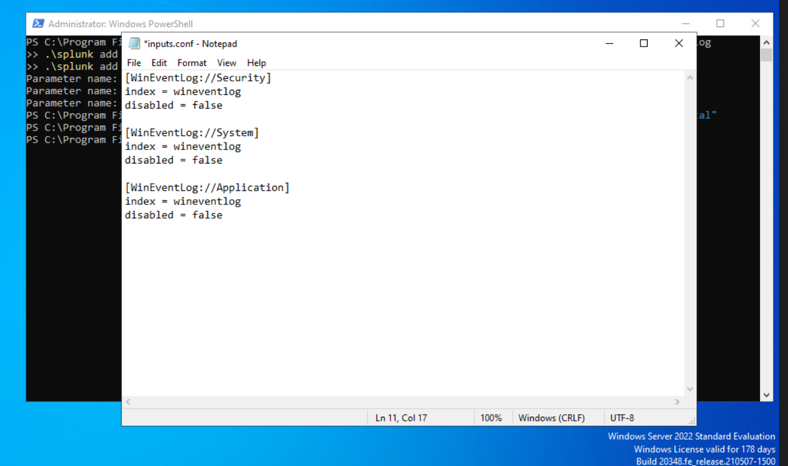
*inputs.conf on the client configured to forward Security, System, and Application logs*

---

## Part 3 — Troubleshooting the Connection

### The Problem
After restarting the forwarder, no logs appeared in Splunk. Running netstat 
on the client showed SYN_SENT on port 9997, meaning the client was trying to 
connect to the DC but the connection was never completing.

SYN_SENT is the first step of the TCP three-way handshake. The client sends 
a SYN packet to initiate a connection. The server should respond with SYN-ACK. 
If it stays at SYN_SENT, something is silently dropping the response before 
it gets back (most likely a firewall).

### Diagnosing with netstat
```powershell
netstat -an | findstr 9997
```

netstat shows all active network connections and listening ports. The -a flag 
includes listening ports and -n shows raw IP addresses instead of resolved names. 
The pipe feeds that output into findstr which filters it down to only lines 
mentioning 9997.

On the DC it showed LISTENING — Splunk was running fine.
On the client it showed SYN_SENT — something between them was blocking the connection.

### The Fix — Windows Firewall Rule
Windows Firewall blocks all incoming connections by default unless a rule 
explicitly allows them. Even though Splunk was listening on 9997, the firewall 
on the DC was silently dropping the connection attempts from the client before 
they could reach Splunk.

Had to run PowerShell as Administrator — modifying firewall rules requires 
elevated privileges:

```powershell
netsh advfirewall firewall add rule name="Splunk Forwarder" dir=in action=allow protocol=TCP localport=9997
```

Breaking it down:
- netsh advfirewall — Windows command for managing the firewall
- firewall add rule — create a new rule
- name="Splunk Forwarder" — label so you can find it later
- dir=in — inbound rule, controls traffic coming INTO the DC
- action=allow — let the traffic through instead of blocking it
- protocol=TCP — applies to TCP connections only
- localport=9997 — only applies to this specific port

### Verifying with Test-NetConnection
```powershell
Test-NetConnection -ComputerName 192.168.10.10 -Port 9997
```

Unlike ping which only checks basic reachability, Test-NetConnection attempts 
a full TCP handshake to a specific port and reports whether it succeeded. 
TcpTestSucceeded: True confirmed the firewall rule worked.

### Screenshots
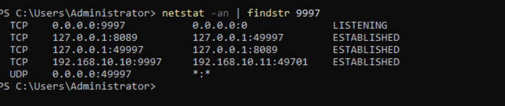
*DC showing LISTENING on port 9997*

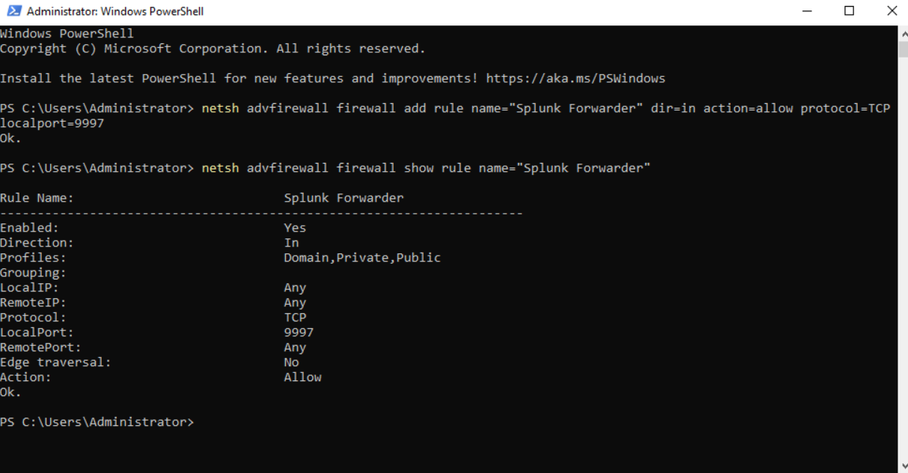
*Firewall rule successfully created on the DC*

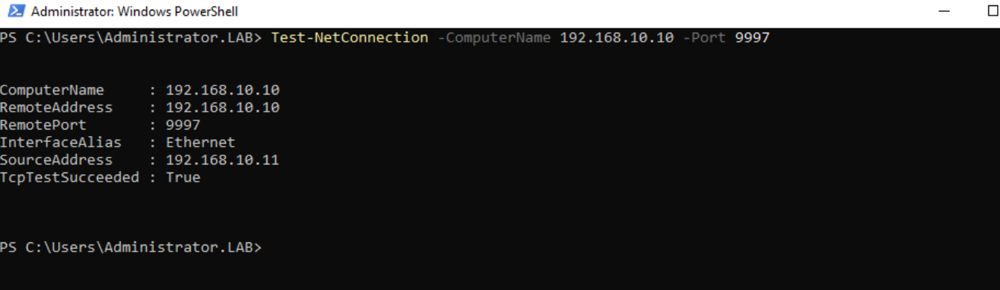
*TcpTestSucceeded: True — connection between client and Splunk is open*

---

## Part 4 — Verifying Logs in Splunk

### Confirming Events Are Flowing
Searched index=wineventlog in Splunk and got 61 events in the first 15 minutes, 
all from WINCLIENT01.lab.local across Security, System, and Application channels.

After configuring DC inputs.conf and restarting Splunk, events from the DC 
started flowing in as well. Both machines confirmed.

### Reading a Real Log Entry
One of the first events that came through:
EventCode: 5379
LogName: Security
ComputerName: WINCLIENT01.lab.local
Account Name: WINCLIENT01$
Read Operation: Enumerate Credentials
Message: Credential Manager credentials were read

EventCode 5379 means something read stored credentials from Windows Credential 
Manager. The dollar sign on WINCLIENT01$ means it's a computer account, not a 
human user (the machine itself triggered this automatically in the background).

In this case it was routine Windows maintenance. But attackers trigger this same 
EventCode when they use tools like Mimikatz to dump credentials from memory. 
Knowing what normal looks like is how you spot what's abnormal. That's the 
whole point of having a SIEM.

### Key EventCodes to Know
Every Windows activity has a numeric EventCode. These are the ones that will 
show up when attacks run:

- 4625 — failed login, shows up during password spraying
- 4769 — Kerberos service ticket requested, shows up during Kerberoasting
- 4768 — Kerberos TGT requested, shows up during AS-REP Roasting
- 4624 — successful login, baseline for normal vs suspicious
- 4672 — special privileges assigned, shows up during privilege escalation
- 4662 — object access, shows up during BloodHound enumeration

### Screenshots
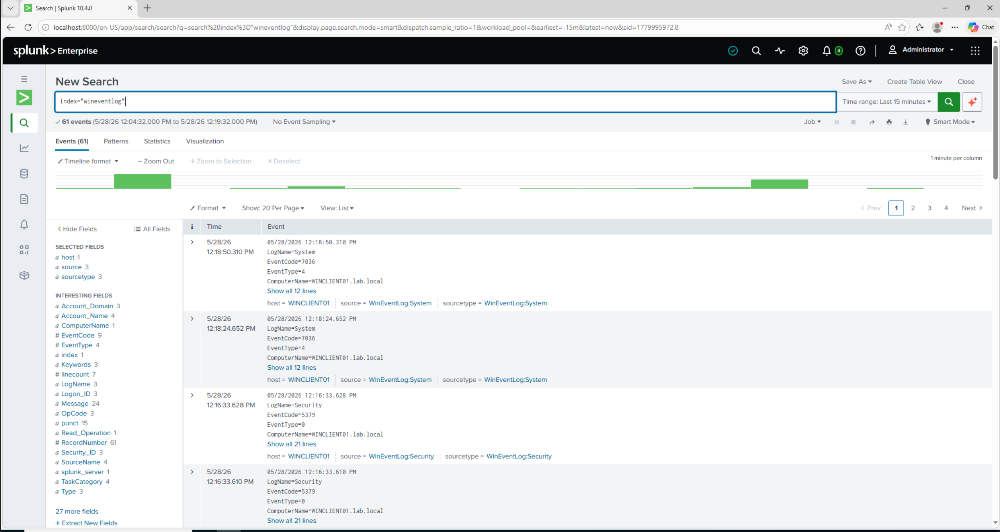
*61 events flowing from WINCLIENT01 into Splunk — lab is wired up (5379 is seen on the bottom)*

---

## Part 5 — Configuring Kali on the Internal Network

### Setting a Static IP
Kali starts on NAT by default. Switched the network adapter to Internal Network 
(labnetwork) in VirtualBox settings, then configured a static IP using 
NetworkManager instead of editing /etc/network/interfaces directly, since modern 
Kali uses NetworkManager and editing that file causes conflicts.

```bash
sudo nmcli con add type ethernet con-name "labnetwork" ifname eth0 ip4 192.168.10.12/24 ipv4.dns 192.168.10.10 ipv4.method manual
sudo nmcli con up "labnetwork"
```

### Why DNS Points at the DC
Kali's DNS is set to 192.168.10.10 because attack tools like BloodHound and 
CrackMapExec query the domain by name, not just IP. Without being able to 
resolve lab.local, Kali can't enumerate users, find SPNs, or authenticate 
against the domain. DNS is what translates the domain name into the address 
Kali needs to send attack traffic to.

### Verifying Connectivity
```bash
ping 192.168.10.10 -c 4   # reach the DC
ping lab.local -c 4        # resolve the domain name
```

Both succeeded, confirming Kali is on the network and can reach the DC by 
both IP and domain name.

### Screenshots
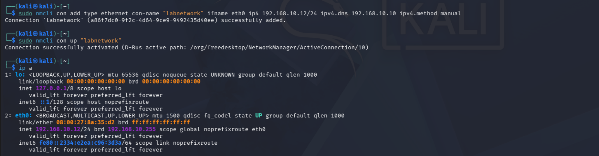
*Kali showing static IP 192.168.10.12 assigned*

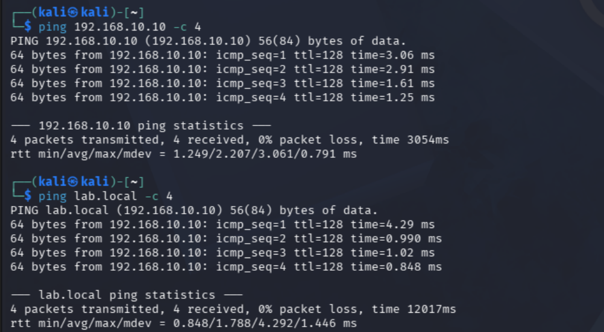
*Kali pinging DC at 192.168.10.10 with 0% packet loss and Kali resolving lab.local — DNS pointing at DC is working*

---

## Part 6 — Problems & Fixes

| Problem | Root Cause | Fix |
|---|---|---|
| splunk add monitor CLI failed | Command doesn't handle WinEventLog format | Edited inputs.conf directly |
| Logs not appearing after forwarder restart | Windows Firewall blocking port 9997 | Added inbound firewall rule for TCP 9997 |
| Firewall rule didn't save | PowerShell wasn't running as Administrator | Re-ran as Administrator |
| Kali network icon showed disconnected | Edited /etc/network/interfaces which conflicts with NetworkManager | Used nmcli instead |

---

## What I Learned
The firewall troubleshooting was the most useful part of this whole session. 
SYN_SENT is a specific enough signal that you can immediately narrow the problem 
down to something blocking the connection rather than the service itself being 
broken. That kind of systematic diagnosis to check if it's listening, check if 
the client is connecting, and identify what's in between will be something I'll use 
constantly.

The inputs.conf thing was also a good reminder that every GUI and CLI tool is 
just writing to config files under the hood. Going directly to the file is 
faster and gives you more control.

---

## Current Lab State
- Splunk Enterprise installed on DC at 192.168.10.10
- Receiving port 9997 configured and firewall rule added
- wineventlog index created
- DC logs flowing into Splunk via inputs.conf
- Universal Forwarder installed on WINCLIENT01
- Client logs flowing into Splunk via inputs.conf
- Kali Linux on labnetwork at 192.168.10.12
- Kali can reach DC by IP and domain name
- Snapshot taken: "Lab Complete - Pre-Attack"
- Human Status: Tired. Value = True. (There were so many troubles behind the scenes that didn't even make it in here)

## Next Step
The lab is fully built. The next session starts the attack phase.
